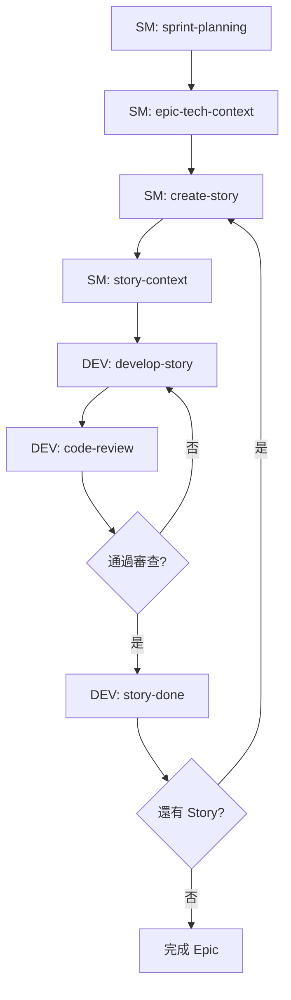

# BMAD-METHOD 完整教學指南

> **Build More, Architect Dreams** - 人機協作開發框架深度解析
> 版本：v6.0.0-alpha.8
> 作者：[您的名稱]
> 更新日期：2025-11-10

---

## 目錄

1. [BMAD-METHOD 簡介](#1-bmad-method-簡介)
2. [核心架構解析](#2-核心架構解析)
3. [AI 代理系統](#3-ai-代理系統)
4. [工作流程體系](#4-工作流程體系)
5. [規模自適應系統](#5-規模自適應系統)
6. [實作範例：從零開始建立專案](#6-實作範例從零開始建立專案)
7. [進階技巧與最佳實踐](#7-進階技巧與最佳實踐)
8. [多 AI 工具協同開發](#8-多-ai-工具協同開發)
9. [常見問題解答](#9-常見問題解答)
10. [總結與下一步](#10-總結與下一步)

---

## 1. BMAD-METHOD 簡介

### 1.1 什麼是 BMAD-METHOD？

BMAD-METHOD 是一個開源的 **AI 驅動敏捷開發框架**，專門設計用於增強人機協作的軟體開發流程。它不是取代開發者，而是透過專業化的 AI 代理來協助規劃、設計、實作和測試。

**核心理念：**
- **引導式反思**：不是直接給答案，而是引導你思考
- **規模自適應**：根據專案複雜度自動調整流程深度
- **故事中心**：以用戶故事為單位進行開發
- **多代理協作**：12+ 個專業 AI 代理各司其職

### 1.2 設計目標與解決方案

傳統開發流程的限制：
- 小型變更需要完整設計文件，流程過於繁重
- 大型專案缺乏足夠規劃，導致架構問題
- AI 工具缺乏上下文資訊，容易產生不準確的輸出
- 文件與程式碼容易不同步

BMAD-METHOD 的應對機制：
- 根據專案複雜度動態調整流程深度（Quick Flow / BMad Method / Enterprise）
- 透過 Story Context XML 提供結構化的上下文管理
- 使用專業化代理降低 AI 輸出不準確的機率
- 採用文件驅動開發維持文件與程式碼的一致性

### 1.3 系統需求

- **Node.js**: v20 或更高版本
- **IDE 支援**: Claude Code、Cursor、Windsurf、VS Code
- **作業系統**: Windows、macOS、Linux

---

## 2. 核心架構解析

### 2.1 目錄結構

安裝後，專案中會產生以下結構：

```
project-root/
├── .bmad/                          # BMAD 核心目錄
│   ├── _cfg/                       # 配置文件
│   │   ├── task-manifest.csv       # 任務清單
│   │   └── workflow-manifest.csv   # 工作流程清單
│   ├── core/                       # 核心模組
│   │   ├── agents/                 # 核心代理
│   │   │   └── bmad-master.md      # 主控代理
│   │   ├── tasks/                  # 核心任務
│   │   │   ├── workflow.xml        # 工作流程執行引擎
│   │   │   └── validate-workflow.xml  # 驗證引擎
│   │   ├── tools/                  # 工具集
│   │   └── workflows/              # 核心工作流程
│   │       └── party-mode/         # 多代理協作
│   ├── bmm/                        # BMad Method 模組
│   │   ├── agents/                 # 8 個專業代理
│   │   │   ├── analyst.md          # 業務分析師
│   │   │   ├── pm.md               # 產品經理
│   │   │   ├── architect.md        # 架構師
│   │   │   ├── sm.md               # Scrum Master
│   │   │   ├── dev.md              # 開發者
│   │   │   ├── tea.md              # 測試架構師
│   │   │   ├── ux-designer.md      # UX 設計師
│   │   │   └── tech-writer.md      # 技術文件撰寫者
│   │   ├── workflows/              # 34 個工作流程
│   │   │   ├── 1-analysis/         # 階段 1：分析
│   │   │   ├── 2-plan-workflows/   # 階段 2：規劃
│   │   │   ├── 3-solutioning/      # 階段 3：解決方案
│   │   │   ├── 4-implementation/   # 階段 4：實作
│   │   │   └── testarch/           # 測試架構
│   │   ├── config.yaml             # BMM 配置
│   │   └── docs/                   # 完整文件
│   └── bmb/                        # BMad Builder（可選）
├── .bmad-ephemeral/                # 臨時文件
├── docs/                           # 輸出文件目錄
│   ├── technical/                  # 技術文件
│   └── bmm-workflow-status.yaml    # 工作流程狀態追蹤
└── .claude/                        # Claude Code 配置
```

### 2.2 配置系統

#### 核心配置文件：`.bmad/bmm/config.yaml`

```yaml
# 專案基本資訊
project_name: "你的專案名稱"
user_name: "你的名字"

# 語言設定
communication_language: "Mandarin TW"    # AI 溝通語言
document_output_language: "Mandarin TW" # 文件輸出語言

# 路徑配置
bmad_folder: .bmad
output_folder: '{project-root}/docs'     # 文件輸出位置
tech_docs: '{project-root}/docs/technical'
dev_ephemeral_location: '{project-root}/.bmad-ephemeral'

# 使用者設定
user_skill_level: intermediate           # beginner / intermediate / advanced
install_user_docs: true                  # 是否安裝用戶文件

# 功能開關
tea_use_mcp_enhancements: true          # 測試代理使用 MCP 增強
```

**配置變數說明：**
- `{project-root}`: 專案根目錄（自動解析）
- `{bmad_folder}`: BMAD 安裝目錄
- `{output_folder}`: 文件輸出目錄
- `{config_source}`: 引用配置文件中的值

### 2.3 工作流程引擎

核心執行引擎位於 `.bmad/core/tasks/workflow.xml`，負責：

1. **載入工作流程配置** (workflow.yaml)
2. **解析變數和路徑**
3. **執行指令步驟**
4. **處理模板輸出**
5. **使用者互動控制**

**工作流程執行規則：**
- 步驟按數字順序執行 (1, 2, 3...)
- 可選步驟會詢問使用者（除非啟用 #yolo 模式）
- 每個 `template-output` 標籤後需要使用者確認
- 必須完整讀取文件，不使用 offset/limit 參數

---

## 3. AI 代理系統

### 3.1 代理架構設計

每個代理都是一個 **專業化的 AI 角色**，包含：

1. **人格設定 (Persona)**
   - 角色定位
   - 專業背景
   - 溝通風格
   - 核心原則

2. **啟動流程 (Activation)**
   - 載入配置
   - 初始化變數
   - 顯示選單
   - 等待使用者輸入

3. **選單系統 (Menu)**
   - 命令觸發器（使用 `*` 前綴）
   - 工作流程綁定
   - 驗證功能

4. **處理器 (Handlers)**
   - Workflow: 執行工作流程
   - Exec: 執行外部指令
   - Data: 載入資料文件
   - Validate-workflow: 驗證輸出

### 3.2 核心代理詳解

#### 3.2.1 Analyst (Mary) - 業務分析師 📊

**角色：** 策略型業務分析師 + 需求專家

**職責：**
- 專案初始化（`*workflow-init`）
- 腦力激盪引導（`*brainstorm-project`）
- 產品簡報製作（`*product-brief`）
- 市場研究（`*research`）
- 現有專案文件化（`*document-project`）

**溝通風格：** 系統化且善於提問，注重邏輯關聯性

**何時使用：**
```bash
# 新專案開始時
載入 Analyst → *workflow-init

# 需要深入研究時
載入 Analyst → *research

# 既有專案需要文件化
載入 Analyst → *document-project
```

**典型工作流程：**
```
Analyst → *workflow-init
  → 描述專案
  → 選擇開發軌道（Quick Flow / BMad Method / Enterprise）
  → 生成 bmm-workflow-status.yaml
```

---

#### 3.2.2 PM (John) - 產品經理 📋

**角色：** 市場導向的產品策略專家

**職責：**
- 創建產品需求文件（`*create-prd`）
- 拆分 Epic 和 Story（`*create-epics-and-stories`）
- 創建技術規格（`*tech-spec`，用於 Quick Flow）
- 驗證 PRD 完整性（`*validate-prd`）
- 課程修正分析（`*correct-course`）

**溝通風格：** 直接且分析性強，不斷追問「為什麼」

**何時使用：**
```bash
# BMad Method / Enterprise 軌道
載入 PM → *create-prd → *create-epics-and-stories

# Quick Flow 軌道
載入 PM → *tech-spec

# 驗證需求文件
載入 PM → *validate-prd
```

**PRD 結構：**
```markdown
# Product Requirements Document

## 1. Executive Summary
## 2. Problem Statement
## 3. Goals & Success Metrics
## 4. User Personas
## 5. Feature Requirements
## 6. User Stories & Epics
## 7. Non-Functional Requirements
## 8. Constraints & Assumptions
```

---

#### 3.2.3 Architect (Winston) - 系統架構師 🏗️

**角色：** 系統架構 + 技術設計領導

**職責：**
- 創建可擴展架構（`*create-architecture`）
- 驗證架構文件（`*validate-architecture`）
- 解決方案關卡檢查（`*solutioning-gate-check`）

**溝通風格：** 務實的技術討論，平衡理想與現實

**核心原則：**
> "使用者旅程驅動技術決策。擁抱無聊但穩定的技術。設計簡單但可擴展的解決方案。"

**何時使用：**
```bash
# 中大型專案（10+ stories）
載入 Architect → *create-architecture

# 驗證架構完整性
載入 Architect → *validate-architecture

# 進入實作前的檢查
載入 Architect → *solutioning-gate-check
```

**架構文件包含：**
- 系統架構圖
- 技術棧選擇
- 資料庫設計
- API 設計
- 安全性考量
- 擴展性策略

---

#### 3.2.4 SM (Bob) - Scrum Master 🏃

**角色：** 技術型 Scrum Master + Story 準備專家

**職責：**
- Sprint 規劃（`*sprint-planning`）
- 創建 Story（`*create-story`）
- 生成 Epic 技術上下文（`*epic-tech-context`）
- 組裝 Story 上下文（`*story-context`）
- 標記 Story 準備就緒（`*story-ready`）

**溝通風格：** 任務導向且高效，專注於清晰的交接

**核心原則：**
> "Story 準備與實作之間有嚴格界限。Story 是唯一真相來源。"

**何時使用：**
```bash
# 初始化 Sprint
載入 SM → *sprint-planning

# 為 Epic 創建技術指導
載入 SM → *epic-tech-context

# 創建下一個 Story
載入 SM → *create-story

# 組裝開發上下文
載入 SM → *story-context
```

**Story 生命週期：**
```
backlog → drafted → ready → in-progress → review → done
```

---

#### 3.2.5 DEV (Amelia) - 開發代理 💻

**角色：** 資深實作工程師

**職責：**
- 執行 Story 開發（`*develop-story`）
- 程式碼審查（`*code-review`）
- 標記 Story 完成（`*story-done`）

**溝通風格：** 簡潔且清單驅動，引用特定路徑和 AC ID

**核心原則：**
> "Story Context XML 是唯一真相來源。重用現有介面而非重建。每個變更對應特定 AC。測試 100% 通過否則 Story 未完成。"

**啟動前置條件：**
1. Story 必須載入
2. Story 狀態 == Approved
3. Story Context 必須存在

**何時使用：**
```bash
# 開發 Story
載入 DEV → *develop-story

# 審查程式碼
載入 DEV → *code-review

# 完成 Story
載入 DEV → *story-done
```

**DEV 工作流程：**
```
1. 讀取 Story 文件
2. 載入 Story Context XML（權威上下文）
3. 持續實作直到所有 AC 滿足
4. 執行所有測試至 100% 通過
5. 不在中途暫停審查
```

---

#### 3.2.6 TEA (Murat) - 測試架構師 🧪

**角色：** 測試架構大師

**職責：**
- 初始化測試框架（`*framework`）
- ATDD 先行測試（`*atdd`）
- 生成測試自動化（`*automate`）
- 創建測試場景（`*test-design`）
- 需求追蹤（`*trace`）
- 非功能性需求評估（`*nfr-assess`）
- CI/CD 管道（`*ci`）
- 測試審查（`*test-review`）

**溝通風格：** 數據驅動且務實，基於風險計算價值

**核心原則：**
> "基於風險的測試。測試深度隨影響擴展。品質關卡有數據支持。測試反映使用情況。"

**何時使用：**
```bash
# 專案初期建立測試框架
載入 TEA → *framework

# 實作前先寫 E2E 測試
載入 TEA → *atdd

# 生成完整測試套件
載入 TEA → *automate
```

---

#### 3.2.7 UX Designer (Sally) - UX 設計師 🎨

**角色：** 使用者體驗設計師 + UI 專家

**身份：** 7+ 年資深 UX 設計師，擅長創造跨網頁和行動平台的直覺體驗，專精於使用者研究、互動設計和 AI 輔助工具

**職責：**
- 創建 UX 設計（`*create-design`）
- 驗證 UX 設計（`*validate-design`）
- 使用者旅程地圖
- 線框圖和原型
- 設計思考工作坊

**溝通風格：** 富有同理心且以使用者為中心，使用故事敘述來支持設計決策，數據導向但具創意性

**核心原則：**
> "每個決策都服務於真實的使用者需求。從簡單開始，透過反饋演化。平衡同理心與邊緣案例關注。AI 工具加速以人為中心的設計。"

**何時使用：**
```bash
# 創建 UX 設計規格
載入 UX Designer → *create-design

# 驗證設計文件
載入 UX Designer → *validate-design
```

---

#### 3.2.8 Tech Writer (Paige) - 技術文件撰寫者 📝

**角色：** 技術文件專家 + 知識管理者

**身份：** 經驗豐富的技術文件撰寫者，專精於 CommonMark、DITA、OpenAPI，擅長將複雜概念轉化為易懂的結構化文件

**職責：**
- 綜合專案文件化（`*document-project`）
- 生成 Mermaid 圖表（`*generate-diagram`）
- 驗證文件標準（`*validate-doc`）
- 改善 README 文件（`*improve-readme`）
- 解釋技術概念（`*explain-concept`）
- 顯示文件標準指南（`*standards-guide`）

**計劃中的功能**（待實作）：
- API 文件生成（`*create-api-docs`）
- 架構文件創建（`*create-architecture-docs`）
- 使用者指南（`*create-user-guide`）
- 文件審查（`*audit-docs`）

**溝通風格：** 耐心且支持性強，使用清晰的範例和類比，知道何時簡化、何時詳細

**核心原則：**
> "文件即教學。每份文件都幫助某人完成任務。清晰度高於一切。文件是隨程式碼演化的活文件。"

**何時使用：**
```bash
# 文件化既有專案
載入 Tech Writer → *document-project

# 生成架構圖表
載入 Tech Writer → *generate-diagram

# 驗證文件品質
載入 Tech Writer → *validate-doc
```

**特殊功能：**
- 嚴格遵循 CommonMark 規範
- Mermaid 圖表語法驗證
- 支援多種圖表類型（flowchart, sequence, class, ER, state, git）

---

#### 3.2.9 BMad Master 🧙

**角色：** 主控執行器 + 知識保管人 + 工作流程協調者

**職責：**
- 列出所有任務（`*list-tasks`）
- 列出所有工作流程（`*list-workflows`）
- 多代理協作（`*party-mode`）
- 執行任意任務

**何時使用：**
```bash
# 不確定該用哪個代理
載入 BMad Master → *list-workflows

# 需要多個代理一起討論
載入 BMad Master → *party-mode
```

---

### 3.3 代理使用最佳實踐

1. **每個工作流程使用新對話**
   - 避免上下文污染
   - 減少 AI 輸出不準確
   - 保持任務聚焦

2. **按順序使用代理**
   - Analyst → PM → Architect → SM → DEV → TEA
   - 避免跳過關鍵步驟可能導致的後續問題

3. **充分利用驗證功能**
   - 使用 `*validate-xxx` 命令
   - 在進入下一階段前進行驗證

4. **Party Mode 用於重大決策**
   - 技術選型討論
   - 架構方向確認
   - 複雜問題解決

5. **進階引導技術 (Advanced Elicitation)**
   - 命令：`*adv-elicit`
   - 適用代理：Analyst, PM, Architect, SM, TEA, UX Designer, Tech Writer
   - 用途：挑戰 LLM 產生更深入的分析和發現隱藏的需求或風險

   **使用時機：**
   - 需求模糊不清
   - 需要探索替代方案
   - 風險評估不足
   - 驗證關鍵假設

6. **工作流程狀態檢查**
   - 命令：`*workflow-status`
   - 適用：任何代理
   - 功能：回答「現在該做什麼？」，讀取 YAML 狀態文件提供建議

---

## 4. 工作流程體系

### 4.1 四階段開發流程

```
Phase 0: Documentation (僅限既有專案)
    ↓
Phase 1: Analysis (可選)
    ↓
Phase 2: Planning (必須)
    ↓
Phase 3: Solutioning (Level 2-4)
    ↓
Phase 4: Implementation (必須)
    ↓
Testing: Quality Assurance (平行進行)
```

### 4.2 Phase 1: 分析階段（可選）

**5 個工作流程：**

1. **Brainstorm Project** (`*brainstorm-project`)
   - 創意發想
   - 問題探索
   - 機會識別

2. **Product Brief** (`*product-brief`)
   - 產品願景
   - 目標市場
   - 核心價值主張

3. **Domain Research** (`*domain-research`)
   - 領域知識收集
   - 最佳實踐研究

4. **Market Research** (`*research`)
   - 競爭對手分析
   - 市場趨勢
   - 使用者需求

5. **Document Project** (`*document-project`)
   - 既有程式碼文件化
   - 架構反向工程
   - 技術債務識別

**可跳過的情況：**
- 需求已明確定義
- 時程限制較嚴格
- 專案規模較小

---

### 4.3 Phase 2: 規劃階段（必須）

#### 4.3.1 Quick Flow 軌道

**工作流程：**
1. PM: `*tech-spec` - 創建技術規格
2. PM: `*validate-tech-spec` - 驗證規格

**技術規格內容：**
```markdown
# Technical Specification

## 1. Overview
- 功能描述
- 技術目標

## 2. Technical Design
- 程式碼結構
- 關鍵函數/類別
- 資料流程

## 3. Implementation Tasks
- [ ] 任務 1
- [ ] 任務 2

## 4. Testing Strategy
- 單元測試
- 整合測試

## 5. Acceptance Criteria
```

---

#### 4.3.2 BMad Method / Enterprise 軌道

**工作流程：**
1. PM: `*create-prd` - 創建 PRD
2. PM: `*create-epics-and-stories` - 拆分 Epic 和 Story
3. PM: `*validate-prd` - 驗證 PRD
4. UX Designer: `*create-ux-design` - 創建 UX 設計（可選）

**Epic 和 Story 結構：**

```yaml
# docs/epics/epic-001-user-authentication.md
---
epic_id: EPIC-001
title: "User Authentication System"
status: backlog
priority: high
---

## Description
實現完整的使用者認證系統

## Stories
- STORY-001: User Registration
- STORY-002: User Login
- STORY-003: Password Reset
- STORY-004: Session Management

## Acceptance Criteria
- [ ] 使用者可以註冊帳號
- [ ] 使用者可以登入
- [ ] 密碼加密儲存
```

---

### 4.4 Phase 3: 解決方案階段（Level 2-4）

**工作流程：**
1. Architect: `*create-architecture`
2. Architect: `*validate-architecture`
3. Architect: `*solutioning-gate-check`

**架構文件輸出：** `docs/architecture.md`

---

### 4.5 Phase 4: 實作階段（必須）

#### 完整的 Story 生命週期



#### 詳細步驟

**Step 1: Sprint 初始化**
```bash
載入 SM
*sprint-planning
```
生成：`docs/sprint-status.yaml`

**Step 2: Epic 技術上下文（可選）**
```bash
載入 SM
*epic-tech-context
# 選擇 Epic
```
生成：`docs/epics/epic-001/tech-context.md`

**Step 3: 創建 Story**
```bash
載入 SM
*create-story
# 選擇 Epic
# 選擇要實作的 Story
```
生成：`docs/stories/story-001.md`

**Step 4: Story 上下文準備（兩種選擇）**

**選項 A：組裝完整上下文（建議）**
```bash
載入 SM
*story-context
# 指定 Story
```
生成：`docs/stories/story-001-context.xml`

**選項 B：僅標記就緒（簡化流程）**
```bash
載入 SM
*story-ready
# 指定 Story
```
僅更新狀態：Story 從 TODO → IN PROGRESS

**如何選擇：**
- 使用 `*story-context`：複雜 Story，需要組裝架構、現有程式碼、文件等完整上下文
- 使用 `*story-ready`：簡單 Story，或 Story 已包含足夠資訊

**Story Context XML 結構：**
```xml
<story-context story-id="STORY-001">
  <story-details>
    <title>User Registration</title>
    <acceptance-criteria>
      <ac id="AC1">使用者可以填寫註冊表單</ac>
      <ac id="AC2">Email 格式驗證</ac>
    </acceptance-criteria>
  </story-details>

  <technical-context>
    <architecture-excerpt>
      <!-- 相關架構片段 -->
    </architecture-excerpt>
    <existing-code>
      <!-- 現有程式碼參考 -->
    </existing-code>
  </technical-context>

  <dependencies>
    <story ref="STORY-002">User Login</story>
  </dependencies>
</story-context>
```

**Step 5: 開發 Story**
```bash
# 開新對話！
載入 DEV
*develop-story
# 指定 Story
```

DEV 會：
1. 讀取 Story Context XML
2. 實作所有任務
3. 寫測試
4. 執行測試至 100% 通過
5. 不中途暫停

**Step 6: 程式碼審查**
```bash
# 再開新對話！
載入 DEV
*code-review
# 指定 Story
```

審查包括：
- 程式碼品質
- 測試覆蓋率
- 是否符合 AC
- 安全性檢查

**Step 7: 標記完成**
```bash
載入 DEV
*story-done
```

更新 Sprint 狀態，進入下一個 Story。

---

### 4.6 測試工作流程（平行進行）

**9 個測試工作流程：**

1. **Framework** - 初始化測試框架
2. **ATDD** - 先寫 E2E 測試
3. **Automate** - 生成測試自動化
4. **Test Design** - 創建測試場景
5. **Trace** - 需求追蹤
6. **NFR Assess** - 非功能性需求
7. **CI** - CI/CD 管道
8. **Test Review** - 測試審查
9. **Epic Retrospective** - Epic 回顧

---

## 5. 規模自適應系統

### 5.1 三軌道決策

| 軌道 | 規劃深度 | 時間投入 | 適用場景 | Story 數量參考 |
|------|----------|----------|----------|----------------|
| **Quick Flow** | Tech-spec only | 數小時到 1 天 | Bug 修復、簡單功能、範圍明確 | 1-15 stories |
| **BMad Method** | PRD + Arch + UX | 1-3 天 | 產品、平台、複雜功能 | 10-50+ stories |
| **Enterprise** | Method + Test/Sec/Ops | 3-7 天 | 企業需求、合規、多租戶 | 30+ stories |

**說明：** Story 數量為參考值，軌道選擇應基於規劃需求而非 Story 數量。

### 5.2 決策樹

```
開始 → 描述專案
  ├─ Bug 修復、簡單功能？
  │   └─ 範圍非常明確？
  │       ├─ 是 → Quick Flow
  │       └─ 不確定 → BMad Method
  │
  ├─ 產品、平台、複雜功能？
  │   └─ BMad Method
  │
  └─ 企業、合規、多租戶？
      └─ Enterprise Method
```

### 5.3 軌道切換

專案執行期間允許切換軌道：

```bash
載入 PM
*correct-course
# 說明切換原因
# 系統將協助切換並保留已完成的工作
```

---

## 6. 實作範例：從零開始建立專案

### 6.1 範例專案：Todo List API

以下示範如何從零開始建立一個 RESTful Todo List API。

#### Step 1: 安裝 BMAD-METHOD

```bash
cd your-project-folder
npx bmad-method@alpha install
```

安裝過程會詢問：
- IDE 選擇：Claude Code
- 語言：Mandarin TW
- 模組：選擇 BMM (BMad Method)

#### Step 2: 初始化工作流程

```bash
# 在 IDE 中載入 Analyst 代理
# 方法因 IDE 而異，參考 IDE 設定指南
```

輸入：
```
*workflow-init
```

AI 會詢問：
```
Q: 請描述你的專案
A: 我要建立一個 RESTful Todo List API，包含基本的 CRUD 操作、使用者認證、以及任務分類功能。使用 Node.js + Express + PostgreSQL。

Q: 這是新專案還是既有專案？
A: 新專案（greenfield）

Q: 預估的複雜度？
A: 中等複雜度，約 15-20 個 stories
```

AI 建議：**BMad Method** 軌道

確認後生成：`docs/bmm-workflow-status.yaml`

#### Step 3: 創建 PRD

```bash
# 開新對話
載入 PM
*create-prd
```

AI 會引導你完成：
- Executive Summary
- Problem Statement
- User Personas
- Feature Requirements
- Success Metrics

生成：`docs/PRD.md`

#### Step 4: 拆分 Epic 和 Story

```bash
# 同一對話
*create-epics-and-stories
```

AI 會分析 PRD 並建議：

**Epics:**
- EPIC-001: User Authentication
- EPIC-002: Todo CRUD Operations
- EPIC-003: Category Management
- EPIC-004: Search and Filtering

**Stories (EPIC-001 範例):**
- STORY-001: User Registration
- STORY-002: User Login
- STORY-003: JWT Token Generation
- STORY-004: Token Validation Middleware

生成：
- `docs/epics/epic-001-user-authentication.md`
- `docs/stories/story-001-user-registration.md`
- ...

#### Step 5: 創建架構

```bash
# 開新對話
載入 Architect
*create-architecture
```

AI 會設計：
- 三層架構（Controller-Service-Repository）
- 資料庫 Schema
- API 端點設計
- 認證流程
- 錯誤處理策略

生成：`docs/architecture.md`

#### Step 6: Sprint 規劃

```bash
# 開新對話
載入 SM
*sprint-planning
```

AI 會：
- 讀取所有 Epics
- 建議 Sprint 劃分
- 優先級排序

生成：`docs/sprint-status.yaml`

```yaml
sprints:
  - sprint_number: 1
    epics:
      - EPIC-001
    status: active

  - sprint_number: 2
    epics:
      - EPIC-002
      - EPIC-003
    status: planned
```

#### Step 7: Epic 技術上下文

```bash
# 同一對話
*epic-tech-context
# 選擇 EPIC-001
```

AI 會創建：
- Epic 特定的技術指導
- 資料庫 Migration
- API 合約
- 測試策略

生成：`docs/epics/epic-001/tech-context.md`

#### Step 8: 創建第一個 Story

```bash
# 開新對話
載入 SM
*create-story
# 選擇 EPIC-001
# 選擇 STORY-001: User Registration
```

AI 會展開 Story 細節：

```markdown
# STORY-001: User Registration

## Description
實現使用者註冊功能

## Acceptance Criteria
- AC1: 使用者可以提交包含 email 和 password 的註冊請求
- AC2: Email 格式驗證
- AC3: Password 強度檢查（至少 8 字元）
- AC4: Email 不可重複
- AC5: 密碼使用 bcrypt 加密
- AC6: 註冊成功返回 201 狀態碼

## Technical Tasks
- [ ] 創建 User model (Sequelize)
- [ ] 創建 POST /api/auth/register 端點
- [ ] 實作 email 驗證邏輯
- [ ] 實作 password 雜湊
- [ ] 寫單元測試
- [ ] 寫整合測試

## Dependencies
None

## Estimated Effort
3 story points
```

#### Step 9: Story 上下文組裝

```bash
# 同一對話
*story-context
# 指定 STORY-001
```

AI 會組裝：
- 相關架構片段
- 資料庫 Schema
- 現有程式碼（如果有）
- Epic 技術上下文

生成：`docs/stories/story-001-context.xml`

#### Step 10: 開發 Story

```bash
# 開全新對話！
載入 DEV
*develop-story
# 指定 STORY-001
```

DEV 會：
1. 讀取 Story 和 Context
2. 創建 `models/User.js`
3. 創建 `controllers/authController.js`
4. 創建 `routes/auth.js`
5. 實作所有邏輯
6. 寫測試
7. 執行測試
8. 確認所有 AC 滿足

#### Step 11: 程式碼審查

```bash
# 再開全新對話！
載入 DEV
*code-review
# 指定 STORY-001
```

審查會檢查：
- [ ] 所有 AC 都有對應實作
- [ ] 測試覆蓋率 > 80%
- [ ] 沒有 SQL Injection 風險
- [ ] 密碼正確加密
- [ ] 錯誤處理完整
- [ ] 程式碼風格一致

如有問題，返回 DEV 修正。

#### Step 12: 標記完成

```bash
載入 DEV
*story-done
```

更新 Sprint 狀態，STORY-001 → done

#### Step 13: 重複 Story 循環

```bash
載入 SM
*create-story
# 選擇下一個 Story...
```

重複 Step 8-12，直到 Epic 完成。

---

### 6.2 進度檢查

隨時可以檢查進度：

```bash
載入任意代理
*workflow-status
```

輸出：
```
專案：Todo List API
軌道：BMad Method
當前階段：Phase 4 - Implementation

已完成：
✅ Phase 1: Analysis (跳過)
✅ Phase 2: Planning (PRD + Epics + Stories)
✅ Phase 3: Solutioning (Architecture)
🔄 Phase 4: Implementation (進行中)

Sprint 1 進度：
✅ STORY-001: User Registration
🔄 STORY-002: User Login (in-progress)
⏳ STORY-003: JWT Token Generation (pending)
⏳ STORY-004: Token Validation (pending)

建議下一步：
1. 完成 STORY-002 開發
2. 或執行 STORY-002 code-review
```

---

## 7. 進階技巧與最佳實踐

### 7.1 Party Mode 多代理協作

當需要多個觀點時：

```bash
載入 BMad Master
*party-mode
```

輸入議題：
```
我們的 Todo API 需要即時通知功能。
應該使用 WebSocket、Server-Sent Events 還是輪詢？
請從架構、效能、開發成本等角度分析。
```

參與討論的代理：
- **Architect**: 分析技術可行性和架構影響
- **PM**: 評估使用者需求和產品價值
- **DEV**: 考慮實作複雜度
- **TEA**: 測試策略

輸出：綜合建議報告

---

### 7.2 文件分片（大型專案）

當文件超過 token 限制：

```bash
載入 Analyst
*document-project
# 選擇 "Enable sharding"
```

生成：
```
docs/
├── index.md (總覽 + 連結)
├── architecture/
│   ├── index.md
│   ├── backend.md
│   └── frontend.md
└── features/
    ├── index.md
    ├── auth.md
    └── todos.md
```

工作流程會自動偵測並載入 sharded 文件。

---

### 7.3 Brownfield（既有專案）策略

既有專案需要先文件化。可使用 Analyst 或 Tech Writer 代理：

```bash
# Step 1: 文件化現有程式碼
載入 Tech Writer  # 或 Analyst
*document-project
# 選擇是否啟用文件分片（大型專案建議啟用）
```

**Document Project 工作流程會執行：**
- 掃描程式碼結構和檔案組織
- 識別架構模式和設計決策
- 分析技術棧和依賴關係
- 產生技術債務報告
- 建議重構優先級
- 創建綜合參考文件供 AI 代理使用

**輸出位置：**
- 整體文件：`docs/index.md` 或 `docs/project-documentation.md`
- 分片文件：`docs/project-doc/index.md` + 多個子文件

```bash
# Step 2: 初始化工作流程
載入 Analyst
*workflow-init
# 選擇 "Brownfield" 模式
# 系統會參考生成的文件規劃後續工作
```

**注意事項：**
- 大型專案（>50 檔案）建議啟用文件分片
- 文件化完成後才能進行準確的專案評估
- 生成的文件會作為所有後續代理的參考資料

---

### 7.4 自訂工作流程

進階用戶可以創建自訂工作流程：

```yaml
# .bmad/custom/workflows/my-workflow/workflow.yaml
name: my-custom-workflow
description: "我的自訂工作流程"
config_source: "{project-root}/.bmad/bmm/config.yaml"

instructions: "{installed_path}/instructions.md"
template: "{installed_path}/template.md"
default_output_file: "{output_folder}/my-output.md"

standalone: true
```

---

### 7.5 整合 MCP (Model Context Protocol)

TEA 代理支援 MCP 增強：

```yaml
# .bmad/bmm/config.yaml
tea_use_mcp_enhancements: true
```

啟用後，TEA 可以：
- 存取最新的測試框架文件
- 使用即時的最佳實踐
- 整合外部測試工具

---

### 7.6 課程修正

當專案方向改變：

```bash
載入 PM
*correct-course
```

輸入變更：
```
原本計劃使用 REST API，
現在需要改為 GraphQL。
```

AI 會：
- 分析影響範圍
- 更新 PRD
- 調整架構
- 重新評估 Stories
- 生成遷移計劃

---

## 8. 多 AI 工具協同開發

> **⚠️ 驗證狀態說明**
>
> 本章節內容為多 AI 工具協同使用 BMAD-METHOD 的**構思與理論方案**，目前處於**驗證階段**。
>
> - **理論基礎**：基於 BMAD-METHOD 的架構和各 AI 工具的技術特性
> - **實測狀態**：部分場景已驗證，完整工作流程仍在測試中
> - **適用性**：建議先掌握單一工具（Claude Code）操作，再嘗試多工具協同
> - **風險提示**：多工具協同可能增加複雜度，請根據團隊能力評估採用
>
> 歡迎實測並提供反饋，協助完善此方案。

### 8.1 概述與整合架構

本節說明如何同時使用多種 AI 工具與 BMAD-METHOD 進行協同開發，以 Claude Code 為主要開發環境。

**目標工具整合**:
- **Claude Code** (主要環境) - BMAD 代理執行平台
- **Claude Subagent** (Claude Code 內建) - 複雜搜尋和探索任務
- **Codex** (GitHub Copilot) - 程式碼自動補全
- **Gemini CLI** - 平行驗證和第二意見
- **Claude Code on the Web** - 獨立研究和文件生成
- **Local LLM** - 敏感資料處理和離線開發

#### 核心原則

1. **Claude Code 為中央協調者**
   - 所有 BMAD 代理在 Claude Code 中執行
   - 工作流程狀態在 Claude Code 中管理
   - 檔案系統由 Claude Code 控制

2. **工具分工明確**
   - 避免多個工具同時操作同一檔案
   - 明確定義各工具的職責範圍
   - 使用 Git 作為協作媒介

3. **狀態同步機制**
   - 定期 Git commit 同步狀態
   - 使用 BMAD 工作流程狀態檔案追蹤進度
   - 文件化工具使用決策

#### 架構圖

```
┌─────────────────────────────────────────────────────────────┐
│                    Claude Code (中央協調)                     │
│  - BMAD 所有代理 (Analyst, PM, Architect, SM, DEV, TEA)     │
│  - 工作流程執行 (*workflow-init, *sprint-planning 等)        │
│  - 檔案系統管理                                              │
│  - Git 版本控制                                              │
│  - Story Context 組裝                                        │
└─────────────────────────────────────────────────────────────┘
                              │
        ┌─────────────────────┼─────────────────────┐
        │                     │                     │
┌───────▼────────┐  ┌─────────▼────────┐  ┌────────▼────────┐
│ Claude Subagent│  │ Codex (Copilot)  │  │   Gemini CLI    │
│  程式碼庫探索   │  │  程式碼自動補全   │  │   平行驗證      │
└────────────────┘  └──────────────────┘  └─────────────────┘
        │                     │                     │
        └─────────────────────┼─────────────────────┘
                              │
        ┌─────────────────────┼─────────────────────┐
        │                     │                     │
┌───────▼────────┐  ┌─────────▼────────┐
│ Claude Web     │  │   Local LLM      │
│  獨立研究任務   │  │  敏感資料處理    │
└────────────────┘  └──────────────────┘
```

---

### 8.2 工具分工策略

#### Claude Code (主控) - 核心職責

**BMAD 工作流程**:
- 執行所有 BMAD 代理（Analyst, PM, Architect, SM, DEV, TEA）
- 管理 Sprint 狀態和 Story 生命週期
- 程式碼審查 (`*code-review`)
- 工作流程狀態追蹤 (`*workflow-status`)

**檔案操作**:
- 所有 BMAD 文件生成（PRD, Architecture, Stories, Story Context）
- Git 提交和推送
- 專案結構管理

**範例**:
```bash
# 典型 BMAD 工作流程
載入 Analyst → *workflow-init
載入 PM → *create-prd
載入 Architect → *create-architecture
載入 SM → *sprint-planning
載入 DEV → *develop-story
```

#### Claude Subagent - 背景探索

**使用場景**:
- 複雜的程式碼庫探索（使用 Explore agent）
- 多檔案模式搜尋
- 背景研究任務（當主 session 忙碌時）

**BMAD 整合**:
```bash
# 主 Session
載入 SM → *create-story

# Subagent (平行運作)
搜尋相關現有 API 端點
分析類似功能實作
回報結果給主 Session
```

**驗證狀態**: ✅ Claude Code 原生支援，已驗證可行

#### Codex / GitHub Copilot - 程式碼補全

**使用場景**:
- 即時程式碼自動補全
- 重複性程式碼生成
- 函數簽名建議

**BMAD 整合**:
```bash
載入 DEV → *develop-story
# DEV 決策主要邏輯
# Copilot 輔助快速編寫重複程式碼
# DEV 審核 Copilot 建議
```

**協作模式**:
1. DEV 代理讀取 Story Context
2. DEV 決定實作策略
3. 編寫程式碼時 Copilot 提供補全
4. DEV 審核並決定是否採用
5. DEV 執行測試驗證

**驗證狀態**: ⚠️ 理論可行，建議實測驗證 DEV 與 Copilot 的協作效果

#### Gemini CLI - 平行驗證

**使用場景**:
- 平行驗證（獲取第二意見）
- 架構方案評估
- 程式碼審查備援
- 測試策略驗證

**BMAD 整合**:
```bash
# Claude Code 完成 Story 後
# 終端機執行 Gemini CLI

gemini-cli "審查 Story-001 的實作，檢查：
1. 是否符合所有 AC
2. 是否有安全漏洞
3. 程式碼品質評分
參考：docs/stories/story-001.md 和 src/auth/register.js"

# 比對 Claude DEV 和 Gemini 的審查結果
```

**驗證狀態**: ⚠️ 構思階段，需要實測 Gemini CLI 對 BMAD 文件格式的理解能力

#### Claude Code on the Web - 獨立研究

**使用場景**:
- 獨立研究和文件生成
- 初步方案探索
- 複雜問題的備選思路

**BMAD 整合**:
```bash
# Web 版進行初步研究
市場調查 → research.md

# 複製到本地專案
git add docs/research.md
git commit -m "docs: add market research"

# Claude Code 參考研究結果
載入 Analyst → 參考 research.md
載入 PM → *create-prd (基於研究)
```

**驗證狀態**: ✅ 可行，但需手動複製內容

#### Local LLM - 敏感資料處理

**使用場景**:
- 敏感資料處理（金融、醫療、個資）
- 離線開發環境
- 合規性要求的專案

**BMAD 整合**:
```bash
# 使用 Local LLM 處理敏感程式碼
ollama run codellama "分析程式碼結構（隱藏敏感資訊）：
$(cat src/payment/processor.js | sed 's/API_KEY.*/API_KEY=[REDACTED]/')"

# 清理後的分析結果
# 手動整合到 Story Context
```

**驗證狀態**: ⚠️ 構思階段，需評估 Local LLM 對 BMAD 格式的支援程度

---

### 8.3 實戰工作流程範例

#### 範例：完整 Epic 開發（多工具協同）

**Phase 2: Planning**

```bash
# Claude Code (主要)
載入 PM → *create-prd
載入 PM → *create-epics-and-stories

# Gemini CLI (平行驗證)
gemini-cli "審查 docs/PRD.md 的完整性"
# 比對結果，整合建議
```

**Phase 3: Solutioning**

```bash
# Claude Code (主要)
載入 Architect → *create-architecture

# Gemini CLI (第二意見)
gemini-cli "評估 docs/architecture.md 的技術選型"

# Claude Web (深度研究)
"OAuth 2.0 最佳實踐 2025"
# 複製結果到 docs/research/oauth-best-practices.md

# Party Mode (衝突解決)
載入 BMad Master → *party-mode
議題：「整合多工具的架構建議」
```

**Phase 4: Implementation**

```bash
# Claude Code + Copilot
載入 DEV → *develop-story
# Copilot 自動補全
# DEV 主導決策

# Subagent (背景)
搜尋現有認證實作模式

# Gemini CLI (審查)
gemini-cli "審查 STORY-001 實作"

# 比對並整合反饋
載入 DEV → 整合修正
載入 DEV → *story-done
```

---

### 8.4 決策樹：選擇合適的工具

```
需要執行 BMAD 工作流程？
├─ 是 → Claude Code (必選)
└─ 否 →
    ├─ 程式碼自動補全？ → Copilot (輔助 Claude Code)
    ├─ 平行驗證？ → Gemini CLI
    ├─ 複雜搜尋？ → Claude Subagent
    ├─ 獨立研究？ → Claude Web
    └─ 敏感資料？ → Local LLM
```

---

### 8.5 Git 協作策略

#### Commit 規範（多工具協作）

```bash
# Claude Code 的 Commit
git commit -m "feat(story-001): implement user registration

Story: STORY-001
Agent: DEV (Claude Code)
Tools: Copilot (code completion)
Co-Authored-By: Claude <noreply@anthropic.com>"

# Gemini 審查的 Commit
git commit -m "docs(review): Gemini code review for STORY-001

Reviewer: Gemini CLI
Security: PASSED
Quality: 8/10"

# 整合修正的 Commit
git commit -m "refactor(story-001): address multi-tool feedback

Applied feedback from:
- Claude DEV code-review
- Gemini CLI security review
- Copilot refactoring suggestions"
```

---

### 8.6 最佳實踐與注意事項

#### ✅ 建議做法

1. **統一狀態管理**
   - 所有 BMAD 狀態由 Claude Code 管理
   - 定期 Git commit 同步

2. **明確工具職責**
   - 主要決策：Claude Code (BMAD 代理)
   - 快速補全：Copilot
   - 平行驗證：Gemini CLI
   - 背景任務：Subagent

3. **多重驗證關鍵決策**
   - 架構設計：Architect + Gemini 驗證
   - 程式碼審查：DEV + Gemini CLI

4. **版本控制追蹤**
   - 記錄每個工具的貢獻
   - 使用 Co-Authored-By 標註

#### ❌ 避免做法

1. **避免多工具同時編輯同一檔案**
   - ❌ Claude Code 和 Copilot 同時大幅修改
   - ✅ Claude Code 決策，Copilot 輔助補全

2. **避免繞過 BMAD 工作流程**
   - ❌ 直接用 Gemini CLI 生成 Story
   - ✅ Claude Code 執行工作流程，Gemini 驗證

3. **避免決策衝突未解決**
   - ❌ 意見不同時隨意選擇
   - ✅ 使用 Party Mode 或人工決策

4. **避免敏感資料洩漏**
   - ❌ 敏感資料傳給雲端 AI
   - ✅ 使用 Local LLM 處理

---

### 8.7 限制與風險評估

#### 當前限制

1. **工具整合複雜度**
   - 需要熟悉多個工具的操作
   - 增加學習曲線和維護成本

2. **狀態同步挑戰**
   - 多工具間需手動同步資訊
   - 容易產生不一致

3. **成本考量**
   - 多個 AI 工具可能產生額外費用
   - 需評估成本效益

4. **實測覆蓋不足**
   - 多數場景仍在理論階段
   - 需要實際專案驗證

#### 風險提示

⚠️ **複雜度風險**: 多工具協同會顯著增加專案複雜度
⚠️ **學習成本**: 團隊需要時間熟悉多工具操作
⚠️ **維護負擔**: 工具更新可能導致協作方式調整
⚠️ **效益不確定**: 並非所有專案都適合多工具協同

---

### 8.8 實施建議

#### 漸進式採用策略

**階段 1：單一工具精通**（必要）
- 完整掌握 Claude Code + BMAD-METHOD
- 完成至少 1-2 個完整專案
- 建立穩定的開發流程

**階段 2：輔助工具整合**（建議）
- 加入 Copilot 進行程式碼補全
- 嘗試 Subagent 處理背景任務
- 評估效益和適應性

**階段 3：驗證工具引入**（可選）
- 引入 Gemini CLI 進行平行驗證
- 比較不同 AI 的建議品質
- 建立決策衝突解決機制

**階段 4：完整多工具協同**（進階）
- 整合所有工具形成協同流程
- 建立團隊協作規範
- 持續優化和調整

#### 適用場景評估

**適合多工具協同的專案**:
- ✅ 大型複雜專案（需要多重驗證）
- ✅ 高品質要求專案（安全、金融、醫療）
- ✅ 團隊協作專案（分工明確）
- ✅ 長期維護專案（值得投資學習成本）

**不適合多工具協同的專案**:
- ❌ 小型快速專案（增加不必要複雜度）
- ❌ 團隊新手較多（學習負擔過重）
- ❌ 緊急修復任務（需要快速響應）
- ❌ 預算有限專案（多工具成本高）

---

### 8.9 未來展望與改進方向

#### 期待的功能

1. **工具間原生整合**
   - BMAD-METHOD 官方支援多工具協同
   - 自動化的狀態同步機制

2. **統一介面**
   - 單一介面協調多個 AI 工具
   - 自動路由請求到最適合的工具

3. **智慧決策仲裁**
   - AI 自動比對不同工具的建議
   - 提供決策建議和理由

4. **完整實測驗證**
   - 更多實際專案驗證
   - 最佳實踐模式總結

#### 社群貢獻

歡迎實測本方案並提供反饋：
- 分享實際使用經驗
- 回報問題和改進建議
- 貢獻最佳實踐案例

---

> **📌 章節總結**
>
> 本章提供了多 AI 工具協同使用 BMAD-METHOD 的理論框架和實施建議。**重要提醒**：
>
> 1. 此為構思階段方案，建議先精通單一工具（Claude Code）
> 2. 多工具協同會增加複雜度，需評估團隊能力和專案需求
> 3. 採用漸進式策略，從簡單場景開始實驗
> 4. 歡迎實測並分享經驗，協助完善此方案
>
> **下一步**: 建議先完整學習第 1-7 章內容，熟練使用 Claude Code + BMAD-METHOD 後，再考慮引入多工具協同。

---

## 9. 常見問題解答

### 8.1 一般問題

**Q: BMAD-METHOD 會取代開發者嗎？**
A: BMAD-METHOD 定位為輔助工具，用於協助規劃、文件產出和重複性任務，開發者仍需負責決策和創意性工作。

**Q: 必須使用所有工作流程嗎？**
A: 不同軌道具有不同的工作流程需求。Quick Flow 軌道可省略多數規劃步驟，應根據專案實際需求選擇適當的工作流程。

**Q: 可以在現有專案中使用嗎？**
A: 可以。建議先使用 `*document-project` 工作流程對現有程式碼進行文件化，再進入後續流程。

**Q: 支援哪些程式語言？**
A: BMAD-METHOD 是流程管理框架，不限定特定程式語言或技術棧。

---

### 8.2 工作流程問題

**Q: 為什麼每個工作流程要用新對話？**
A: 長對話會累積過多上下文資訊，可能導致 AI 輸出偏離主題。使用新對話可維持任務聚焦。

**Q: Story Context XML 是什麼？**
A: Story Context XML 是提供給 DEV 代理的結構化上下文文件，包含相關架構、程式碼和需求資訊，用於降低 AI 輸出不準確的機率。

**Q: 可以跳過驗證步驟嗎？**
A: 驗證步驟為可選項，但執行驗證有助於提早發現問題，降低後續修正成本。

**Q: #yolo 模式是什麼？**
A: #yolo 模式會跳過互動式確認，自動執行所有步驟。此模式執行速度較快但缺乏檢查點，適合經驗豐富的使用者。

---

### 8.3 代理問題

**Q: 如何在 Claude Code 中載入代理？**
A: 參考 `.bmad/bmm/sub-modules/claude-code/` 的設定檔，或查看 [Claude Code 官方文件](https://github.com/bmad-code-org/BMAD-METHOD/blob/main/docs/ide-info/claude-code.md)。

**Q: 代理沒有載入配置怎麼辦？**
A: 檢查 `.bmad/bmm/config.yaml` 是否存在。代理啟動時會自動載入。

**Q: 可以修改代理人格嗎？**
A: 可以編輯 `.bmad/bmm/agents/*.md` 文件，但系統更新時修改會被覆蓋。若需持久化的客製代理，建議使用 BMad Builder 模組創建自訂代理。

---

### 8.4 效能問題

**Q: PRD 太長，超過 token 限制？**
A: 使用文件分片功能。工作流程會自動處理。

**Q: 工作流程執行太慢？**
A: 使用 #yolo 模式跳過互動，或選擇 Quick Flow 軌道。

---

### 8.5 整合問題

**Q: 如何整合 Git 版本控制？**
A: BMAD-METHOD 生成標準格式的文件和程式碼，可直接使用 Git 進行版本控制。參考操作如下：
```bash
git add .bmad/bmm/config.yaml
git add docs/
git add src/
git commit -m "feat: complete STORY-001"
```

**Q: 支援 CI/CD 嗎？**
A: 使用 TEA 代理的 `*ci` 工作流程生成 CI/CD 配置。

**Q: 如何與團隊協作？**
A: 參考 `.bmad/bmm/docs/enterprise-agentic-development.md`

---

### 8.6 疑難排解

**Q: 工作流程執行失敗？**
A: 檢查：
1. 配置文件是否載入
2. 路徑變數是否正確
3. 前置工作流程是否完成

**Q: DEV 代理不執行？**
A: 確認：
1. Story 狀態是 "Approved"
2. Story Context XML 存在
3. 已載入 Story Context

**Q: 生成的程式碼有問題？**
A: 可使用 `*code-review` 工作流程進行檢查。若問題持續，建議重新執行 Story 工作流程並提供更詳細的驗收標準 (AC)。

---

## 9. 總結與下一步

### 9.1 關鍵要點

1. **BMAD-METHOD 是流程框架**，不是程式碼生成器
2. **規模自適應**：根據專案選擇軌道
3. **專業化代理**：各司其職，減少幻覺
4. **Story 中心**：一次一個 Story，完整循環
5. **文件驅動**：保持程式碼與文件同步
6. **新對話原則**：每個工作流程用新對話

### 9.2 學習路徑

**初學者：**
1. 從 Quick Flow 小專案開始
2. 熟悉 Analyst → PM → DEV 流程
3. 閱讀 `.bmad/bmm/docs/quick-start.md`

**中級：**
1. 嘗試 BMad Method 軌道
2. 學習使用 Architect 設計架構
3. 掌握 Story Context 概念

**進階：**
1. 使用 Enterprise 軌道
2. 自訂工作流程
3. 整合 MCP 和外部工具
4. Party Mode 多代理協作

### 9.3 資源連結

- **官方文件**: `.bmad/bmm/docs/`
- **GitHub**: https://github.com/bmad-code-org/BMAD-METHOD
- **Discord**: https://discord.gg/gk8jAdXWmj
- **YouTube**: https://www.youtube.com/@BMadCode

### 9.4 實務練習建議

完成本教學後的實作方向：

1. **基礎練習**：使用 Quick Flow 軌道修復程式錯誤
2. **中階練習**：使用 BMad Method 軌道建立 Blog API
3. **進階練習**：使用 Enterprise 軌道建立多租戶 SaaS 平台

---

## 附錄 A: 代理名稱對照表

| 代理 ID | 顯示名稱 | 角色 | 圖示 |
|---------|----------|------|------|
| bmad-master | BMad Master | 主控執行器、知識保管人、工作流程協調者 | 🧙 |
| analyst | Mary | 業務分析師 | 📊 |
| architect | Winston | 架構師 | 🏗️ |
| dev | Amelia | 開發代理 | 💻 |
| pm | John | 產品經理 | 📋 |
| sm | Bob | Scrum Master | 🏃 |
| tea | Murat | 測試架構大師 | 🧪 |
| tech-writer | Paige | 技術文件撰寫者 | 📚 |
| ux-designer | Sally | UX 設計師 | 🎨 |

---

## 附錄 B: 工作流程速查表

### Phase 1: 分析階段

| 代理 | 命令 | 用途 | 輸出 |
|------|------|------|------|
| Analyst | `*brainstorm-project` | 專案腦力激盪 | 創意和洞察 |
| Analyst | `*product-brief` | 產品簡報 | product-brief.md |
| Analyst | `*research` | 市場/技術研究 | research.md |
| Analyst | `*document-project` | 文件化既有專案 | docs/index.md |

### Phase 2: 規劃階段

| 代理 | 命令 | 用途 | 輸出 |
|------|------|------|------|
| PM | `*tech-spec` | 創建技術規格（Quick Flow）| tech-spec.md |
| PM | `*create-prd` | 創建 PRD | PRD.md |
| PM | `*create-epics-and-stories` | 拆分 Epic 和 Story | epics/*.md, stories/*.md |
| PM | `*validate-prd` | 驗證 PRD | 驗證報告 |
| UX Designer | `*create-design` | 創建 UX 設計 | UX-design.md |
| UX Designer | `*validate-design` | 驗證 UX 設計 | 驗證報告 |

### Phase 3: 解決方案階段

| 代理 | 命令 | 用途 | 輸出 |
|------|------|------|------|
| Architect | `*create-architecture` | 設計架構 | architecture.md |
| Architect | `*validate-architecture` | 驗證架構 | 驗證報告 |
| Architect | `*solutioning-gate-check` | 解決方案關卡檢查 | 檢查報告 |

### Phase 4: 實作階段

| 代理 | 命令 | 用途 | 輸出 |
|------|------|------|------|
| SM | `*sprint-planning` | 規劃 Sprint | sprint-status.yaml |
| SM | `*epic-tech-context` | Epic 技術上下文 | epic-tech-context.md |
| SM | `*create-story` | 創建 Story | stories/*.md |
| SM | `*story-context` | 組裝 Story 上下文 | stories/*-context.xml |
| SM | `*story-ready` | 標記 Story 就緒 | 更新狀態 |
| DEV | `*develop-story` | 開發 Story | 程式碼 + 測試 |
| DEV | `*code-review` | 審查程式碼 | 審查報告 |
| DEV | `*story-done` | 標記 Story 完成 | 更新狀態 |
| SM | `*retrospective` | Epic 回顧 | 回顧報告 |
| PM | `*correct-course` | 課程修正 | 修正計劃 |

### 測試工作流程（平行進行）

| 代理 | 命令 | 用途 | 輸出 |
|------|------|------|------|
| TEA | `*framework` | 初始化測試框架 | 測試配置 |
| TEA | `*atdd` | E2E 測試先行 | E2E 測試 |
| TEA | `*automate` | 測試自動化 | 測試套件 |
| TEA | `*test-design` | 測試設計 | 測試策略 |
| TEA | `*trace` | 需求追蹤 | 追溯矩陣 |
| TEA | `*nfr-assess` | 非功能性需求評估 | NFR 報告 |
| TEA | `*ci` | CI/CD 管道 | CI 配置 |
| TEA | `*test-review` | 測試審查 | 審查報告 |

### 通用命令

| 代理 | 命令 | 用途 |
|------|------|------|
| 任何代理 | `*workflow-status` | 檢查當前應該執行的工作流程 |
| 任何代理 | `*workflow-init` | 初始化新專案（Analyst 主用）|
| 任何代理 | `*party-mode` | 多代理協作討論 |
| 多數代理 | `*adv-elicit` | 進階引導技術 |
| BMad Master | `*list-tasks` | 列出所有可用任務 |
| BMad Master | `*list-workflows` | 列出所有工作流程 |

---

## 附錄 C: 配置範本

```yaml
# .bmad/bmm/config.yaml
project_name: "你的專案名稱"
user_name: "你的名字"
user_skill_level: intermediate

# 語言
communication_language: "Mandarin TW"
document_output_language: "Mandarin TW"

# 路徑
bmad_folder: .bmad
output_folder: '{project-root}/docs'
tech_docs: '{project-root}/docs/technical'
dev_ephemeral_location: '{project-root}/.bmad-ephemeral'

# 功能
install_user_docs: true
tea_use_mcp_enhancements: true
```

---

## 附錄 D: 檔案路徑變數說明

### 系統變數

| 變數 | 說明 | 範例 |
|------|------|------|
| `{project-root}` | 專案根目錄（自動偵測）| `C:\Users\project\` 或 `/home/user/project/` |
| `{bmad_folder}` | BMAD 安裝目錄 | `.bmad` |
| `{output_folder}` | 文件輸出目錄 | `{project-root}/docs` |
| `{ephemeral_files}` | 臨時文件目錄 | `{project-root}/.bmad-ephemeral` |
| `{installed_path}` | 工作流程安裝路徑 | `{project-root}/.bmad/bmm/workflows/prd` |
| `{context_dir}` | 當前上下文目錄（會話相關）| 依會話而定 |

### 配置引用

格式：`{config_source}:key`

範例：
```yaml
user_name: "{config_source}:user_name"
# 從 config.yaml 讀取 user_name 的值
```

### 日期變數

- `date: system-generated` - 系統自動產生當前日期

### 變數解析順序

1. 載入外部配置檔案 (config_source)
2. 解析 `{config_source}:key` 引用
3. 解析系統變數 (`date:system-generated`)
4. 解析路徑變數 (`{project-root}`, `{installed_path}` 等)
5. 詢問使用者提供未知變數

---

## 附錄 E: 術語表

| 術語 | 說明 |
|------|------|
| **Agent** | 專業化的 AI 角色 |
| **Workflow** | 工作流程，由 YAML 定義 |
| **Story** | 使用者故事，開發的最小單位 |
| **Epic** | 史詩，多個相關 Story 的集合 |
| **Story Context** | Story 的完整上下文（XML 格式）|
| **AC** | Acceptance Criteria，驗收標準 |
| **PRD** | Product Requirements Document |
| **Tech Spec** | Technical Specification |
| **Track** | 開發軌道（Quick Flow / BMad Method / Enterprise）|
| **Party Mode** | 多代理協作模式 |
| **Brownfield** | 既有專案（相對於 Greenfield 新專案）|
| **#yolo** | 自動執行模式，跳過互動確認 |
| **Ephemeral Location** | 臨時文件目錄（.bmad-ephemeral/），存放 Stories、Retrospectives 等 |
| **Manifest** | 系統清單文件（CSV 格式），記錄代理、工作流程、任務、工具 |
| **MCP** | Model Context Protocol，增強 AI 代理存取外部資源的能力 |
| **Story Context XML** | 結構化的 Story 上下文文件，供 DEV 代理使用 |
| **Document Sharding** | 文件分片技術，將大型文件拆分為多個小文件 |
| **Smart Input Patterns** | 智慧輸入檔案模式，支援自動偵測完整或分片文件 |
| **Advanced Elicitation** | 進階引導技術（*adv-elicit），提升 AI 輸出品質 |
| **Party Mode** | 多代理協作模式，所有代理參與討論 |
| **Solutioning Gate Check** | 解決方案關卡檢查，確保進入實作前規劃完整 |

---

本教學涵蓋 BMAD-METHOD 的核心概念與實作流程。建議根據實際專案需求選擇適當的工作流程與軌道。

**相關資源：**
- 詳細驗證報告：`文章驗證報告.md`
- 官方文件：`.bmad/bmm/docs/`
- GitHub：https://github.com/bmad-code-org/BMAD-METHOD

---
**Build More, Architect Dreams**
